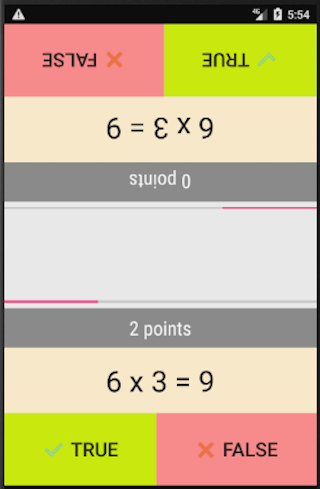

# AndroidMathContest

An native android game for two players built in Java.
Inspired in the game "Two player Reactor"

## Features

* Choose a number to practice multiplications
* Challenge your friends trying to tap quicker in the right answer

## Screenshots

